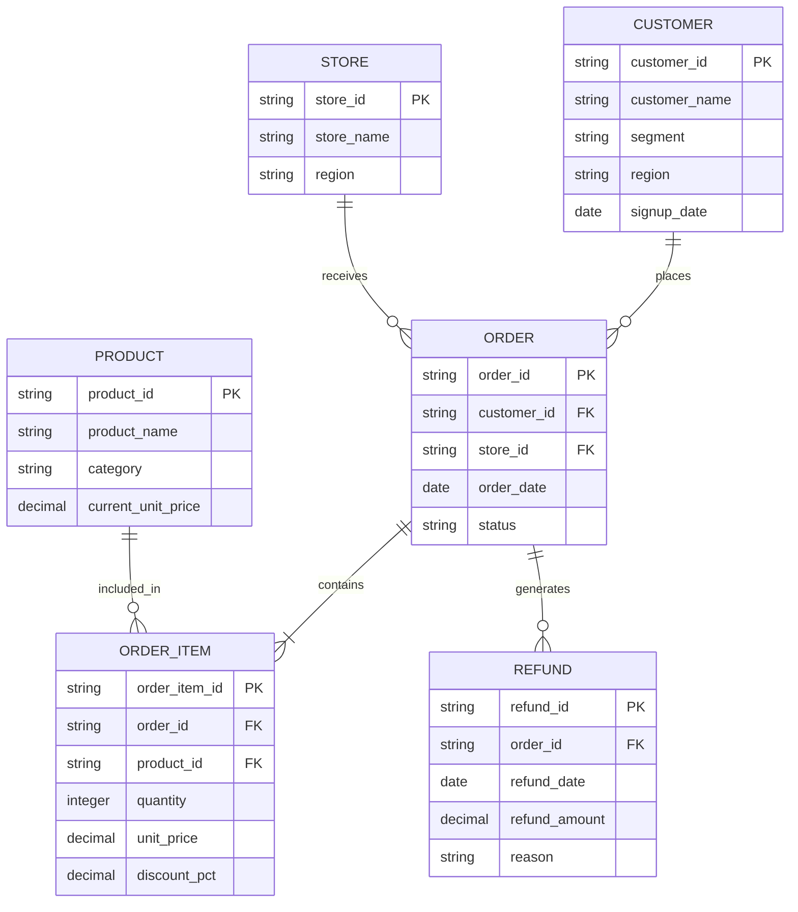

# Semantic Lakehouse Data Model

## 1. Overview

### Purpose

Briefly describe why this data model exists.

This model represents a fictional e-commerce business and is designed to support
analytical workloads and experiments involving LLM-powered natural-language
querying.

The model intentionally contains multiple business entities, fact grains,
relationships, and metric definitions so that we can evaluate whether explicit
semantic context improves analytical query generation.

### Modeling Approach

- Analytical / dimensional-style model
- Synthetic data
- Fact and dimension tables
- Explicit grain for every table
- Apache Iceberg as the table format
- Parquet as the underlying file format
- DuckDB as the analytical query engine

### Scope

**In scope**

- Customers
- Products
- Stores
- Orders
- Order items
- Refunds

**Out of scope**

- Payments
- Shipping
- Inventory
- Suppliers
- Employees
- Marketing campaigns

---

## 2. Entity Relationship Diagram



## 3. Table Classification & Grain

| Table         | Classification | Grain                               |
| ------------- | -------------- | ----------------------------------- |
| `customers`   | Dimension      | One row per customer                |
| `products`    | Dimension      | One row per product                 |
| `stores`      | Dimension      | One row per store                   |
| `orders`      | Fact           | One row per order                   |
| `order_items` | Fact           | One row per product within an order |
| `refunds`     | Fact           | One row per refund event            |


### Important Grain Considerations

`orders` and `order_items` intentionally have different grains
An order can contain multiple produts

```
Order 1001
├── Laptop
├── Mouse
└── Keyboard
```

Therefore:

Counting rows in orders represents number of orders.
Counting rows in order_items represents number of order lines.
Summing order_items.quantity represents units sold.

Confusing these grains can produce incorrect analytical results.

## 4. Data Dictionary

### 4.1 `customers`

**Purpose** : Represents customers who purchase products
**Grain** : One row per customer

| Column          | Data Type | Nullable | Description                              |
| --------------- | --------- | -------: | ---------------------------------------- |
| `customer_id`   | STRING    |       No | Unique customer identifier. Primary key. |
| `customer_name` | STRING    |       No | Synthetic customer name.                 |
| `segment`       | STRING    |       No | Customer segment.                        |
| `region`        | STRING    |       No | Customer geographic region.              |
| `signup_date`   | DATE      |       No | Date the customer registered.            |


**Allowed Values**

`segment`:
- Consumer
- SMB
- Enterprise

`region`:
- North
- South
- East
- West
- Central

**Keys**

***PK***: `customer_id`

### 4.2 `products`

**Purpose**: Represents products available for purchase.

**Grain**: One row per product.

| Column               | Data Type | Nullable | Description                             |
| -------------------- | --------- | -------: | --------------------------------------- |
| `product_id`         | STRING    |       No | Unique product identifier. Primary key. |
| `product_name`       | STRING    |       No | Product name.                           |
| `category`           | STRING    |       No | Product category.                       |
| `current_unit_price` | DECIMAL   |       No | Current product price.                  |


**Allowed Values**

`category`:

- Electronics
- Furniture
- Office Supplies
- Software
- Accessories
- Important Note

`current_unit_price` represents the current product price.

The price actually paid for an order is stored separately in
`order_items`.`unit_price` to preserve the historical transaction price.

**Keys**

***PK***: `product_id`

### 4.3 `stores`

**Purpose**: Represents physical stores through which orders are placed.

**Grain**: One row per store.

| Column       | Data Type | Nullable | Description              |
| ------------ | --------- | -------: | ------------------------ |
| `store_id`   | STRING    |       No | Unique store identifier. |
| `store_name` | STRING    |       No | Store name.              |
| `region`     | STRING    |       No | Store geographic region. |


**Keys**
***PK***: `store_id`

### 4.4 `orders`

**Purpose**: Represents customer purchase transactions.

**Grain**: One row per order.

| Column        | Data Type | Nullable | Description                      |
| ------------- | --------- | -------: | -------------------------------- |
| `order_id`    | STRING    |       No | Unique order identifier.         |
| `customer_id` | STRING    |       No | Customer placing the order.      |
| `store_id`    | STRING    |       No | Store associated with the order. |
| `order_date`  | DATE      |       No | Date the order was placed.       |
| `status`      | STRING    |       No | Lifecycle status of the order.   |


**Allowed Values**

`status`:

 - completed
 - cancelled
 - pending


**Keys**
***PK***: `order_id`

***FK***: `customer_id` → `customers`.`customer_id`

***FK***: `store_id` → `stores`.`store_id`

### 4.5 `order_items`

**Purpose**: Represents individual products purchased within an order.

**Grain**: One row per product within an order.

| Column          | Data Type | Nullable | Description                         |
| --------------- | --------- | -------: | ----------------------------------- |
| `order_item_id` | STRING    |       No | Unique order-line identifier.       |
| `order_id`      | STRING    |       No | Parent order.                       |
| `product_id`    | STRING    |       No | Product purchased.                  |
| `quantity`      | INTEGER   |       No | Number of units purchased.          |
| `unit_price`    | DECIMAL   |       No | Price per unit at time of purchase. |
| `discount_pct`  | DECIMAL   |       No | Discount applied to the item.       |

**Keys**

**PK**: `order_item_id`

**FK**: `order_id` → `orders`.`order_id`

**FK**: `product_id` → `products`.`product_id`

### 4.6 `refunds`

**Purpose**: Represents refunds issued against completed orders.

**Grain**: One row per refund event.

| Column          | Data Type | Nullable | Description               |
| --------------- | --------- | -------: | ------------------------- |
| `refund_id`     | STRING    |       No | Unique refund identifier. |
| `order_id`      | STRING    |       No | Order being refunded.     |
| `refund_date`   | DATE      |       No | Date refund was issued.   |
| `refund_amount` | DECIMAL   |       No | Amount refunded.          |
| `reason`        | STRING    |       No | Reason for refund.        |


**Keys**

***PK***: `refund_id`

***FK***: `order_id` → `orders`.`order_id`

## 5. Relationships

| From     | Relationship | To         | Cardinality |
| -------- | ------------ | ---------- | ----------- |
| Customer | places       | Order      | 1:N         |
| Store    | receives     | Order      | 1:N         |
| Order    | contains     | Order Item | 1:N         |
| Product  | appears in   | Order Item | 1:N         |
| Order    | generates    | Refund     | 1:N         |

**Relationship Rules**

 - Every order must reference an existing customer.
 - Every order must reference an existing store.
 - Every order item must reference an existing order.
 - Every order item must reference an existing product.
 - Every refund must reference an existing order.
