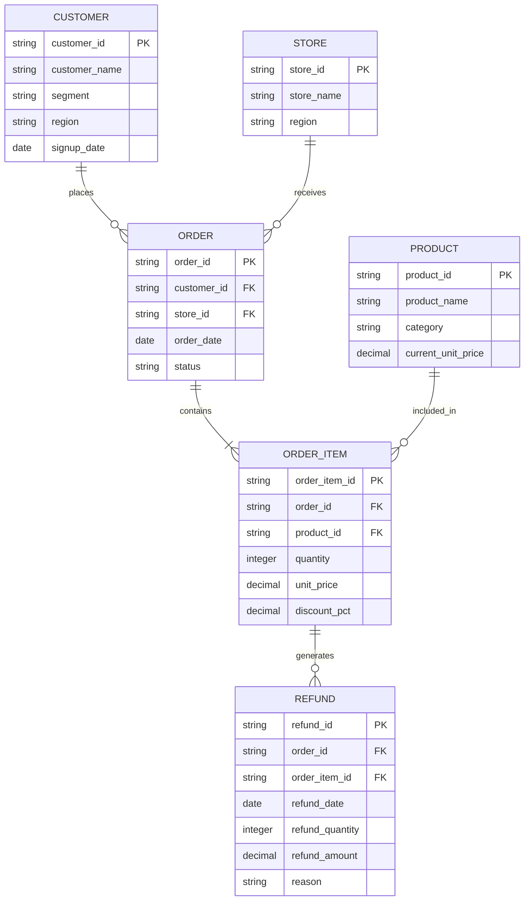

# Semantic Lakehouse Data Model

## 1. Overview

### Purpose

This model represents a fictional e-commerce business and is designed to support
analytical workloads and experiments involving LLM-powered natural-language
querying.

The model intentionally contains multiple business entities, fact grains,
relationships, and metric definitions so that we can evaluate whether explicit
semantic context improves analytical query generation.

### Modeling Approach

- Analytical / dimensional-style model
- Synthetic data
- Fact and dimension tables
- Explicit grain for every table
- Apache Iceberg as the table format
- Parquet as the underlying file format
- DuckDB as the analytical query engine

### Scope

**In scope**

- Customers
- Products
- Stores
- Orders
- Order items
- Refunds

**Out of scope**

- Payments
- Shipping
- Inventory
- Suppliers
- Employees
- Marketing campaigns

---

## 2. Entity Relationship Diagram



The `refunds.order_id` is retained for convenient order-level aggregation and
lineage, while `refunds.order_item_id` identifies the specific order item to
which the refund applies.

---

## 3. Table Classification & Grain

| Table | Classification | Grain |
| --- | --- | --- |
| `customers` | Dimension | One row per customer |
| `products` | Dimension | One row per product |
| `stores` | Dimension | One row per store |
| `orders` | Fact | One row per order |
| `order_items` | Fact | One row per product within an order |
| `refunds` | Fact | One row per refund event against an order item |

### Important Grain Considerations

`orders` and `order_items` intentionally have different grains.

An order can contain multiple products:

```text
Order 1001
├── Laptop
├── Mouse
└── Keyboard
```

Therefore:

- Counting rows in `orders` represents number of orders.
- Counting rows in `order_items` represents number of order lines.
- Summing `order_items.quantity` represents units sold.

Refunds have their own event grain, but each refund is tied to an individual
`order_item`.

Confusing these grains can produce incorrect analytical results.

---

## 4. Data Dictionary

### 4.1 `customers`

**Purpose**: Represents customers who purchase products.

**Grain**: One row per customer.

| Column | Data Type | Nullable | Description |
| --- | --- | ---: | --- |
| `customer_id` | STRING | No | Unique customer identifier. Primary key. |
| `customer_name` | STRING | No | Synthetic customer name. |
| `segment` | STRING | No | Customer segment. |
| `region` | STRING | No | Customer geographic region. |
| `signup_date` | DATE | No | Date the customer registered. |

**Allowed Values**

`segment`:
- Consumer
- SMB
- Enterprise

`region`:
- North
- South
- East
- West
- Central

**Keys**

**PK**: `customer_id`

---

### 4.2 `products`

**Purpose**: Represents products available for purchase.

**Grain**: One row per product.

| Column | Data Type | Nullable | Description |
| --- | --- | ---: | --- |
| `product_id` | STRING | No | Unique product identifier. Primary key. |
| `product_name` | STRING | No | Product name. |
| `category` | STRING | No | Product category. |
| `current_unit_price` | DECIMAL | No | Current product price. |

**Allowed Values**

`category`:
- Electronics
- Furniture
- Office Supplies
- Software
- Accessories

`current_unit_price` represents the current product price.

The price actually paid for an order is stored separately in
`order_items.unit_price` to preserve the historical transaction price.

**Keys**

**PK**: `product_id`

---

### 4.3 `stores`

**Purpose**: Represents physical stores through which orders are placed.

**Grain**: One row per store.

| Column | Data Type | Nullable | Description |
| --- | --- | ---: | --- |
| `store_id` | STRING | No | Unique store identifier. |
| `store_name` | STRING | No | Store name. |
| `region` | STRING | No | Store geographic region. |

**Keys**

**PK**: `store_id`

---

### 4.4 `orders`

**Purpose**: Represents customer purchase transactions.

**Grain**: One row per order.

| Column | Data Type | Nullable | Description |
| --- | --- | ---: | --- |
| `order_id` | STRING | No | Unique order identifier. |
| `customer_id` | STRING | No | Customer placing the order. |
| `store_id` | STRING | No | Store associated with the order. |
| `order_date` | DATE | No | Date the order was placed. |
| `status` | STRING | No | Lifecycle status of the order. |

**Allowed Values**

`status`:
- completed
- cancelled
- pending

**Keys**

**PK**: `order_id`

**FK**: `customer_id` → `customers.customer_id`

**FK**: `store_id` → `stores.store_id`

**Lifecycle Rule**

For this model:

```text
pending → completed
pending → cancelled
```

Completed orders may subsequently have refunds. Cancelled and pending orders
do not have refunds.

---

### 4.5 `order_items`

**Purpose**: Represents individual products purchased within an order.

**Grain**: One row per product within an order.

| Column | Data Type | Nullable | Description |
| --- | --- | ---: | --- |
| `order_item_id` | STRING | No | Unique order-line identifier. Primary key. |
| `order_id` | STRING | No | Parent order. |
| `product_id` | STRING | No | Product purchased. |
| `quantity` | INTEGER | No | Number of units purchased. |
| `unit_price` | DECIMAL | No | Price per unit at time of purchase. |
| `discount_pct` | DECIMAL | No | Discount applied to the item. |

**Keys**

**PK**: `order_item_id`

**FK**: `order_id` → `orders.order_id`

**FK**: `product_id` → `products.product_id`

**Business Rules**

- `quantity` must be greater than zero.
- `discount_pct` must be between 0 and 1.
- `unit_price` represents the transaction-time price and must be used for
  historical revenue calculations.

---

### 4.6 `refunds`

**Purpose**: Represents refund events issued against individual order items
from completed orders.

**Grain**: One row per refund event against an order item.

| Column | Data Type | Nullable | Description |
| --- | --- | ---: | --- |
| `refund_id` | STRING | No | Unique refund identifier. |
| `order_id` | STRING | No | Parent order being refunded. |
| `order_item_id` | STRING | No | Specific order item being refunded. |
| `refund_date` | DATE | No | Date refund was issued. |
| `refund_quantity` | INTEGER | No | Number of units refunded. |
| `refund_amount` | DECIMAL | No | Amount refunded. |
| `reason` | STRING | No | Reason for refund. |

**Keys**

**PK**: `refund_id`

**FK**: `order_id` → `orders.order_id`

**FK**: `order_item_id` → `order_items.order_item_id`

**Relationship Integrity**

`refunds.order_item_id` must belong to the order identified by
`refunds.order_id`.

For example, a refund must never reference `ORD-001` together with an
order item belonging to `ORD-002`.

**Refund Rules**

- Refunds may only reference completed orders.
- An order item may have zero, one, or multiple refund events.
- Aggregate refunded quantity for an order item cannot exceed purchased quantity.
- Aggregate refunded amount for an order item cannot exceed the eligible
  discounted value of that order item.
- Partial refunds are allowed.
- Multiple refund events against the same order item are allowed.

---

## 5. Relationships

| From | Relationship | To | Cardinality |
| --- | --- | --- | --- |
| Customer | places | Order | 1:N |
| Store | receives | Order | 1:N |
| Order | contains | Order Item | 1:N |
| Product | appears in | Order Item | 1:N |
| Order Item | generates | Refund | 1:N |

The `Order → Refund` relationship is also available indirectly through
`order_item_id`, allowing order-level refund aggregation without making the
refund grain order-level.

**Relationship Rules**

- Every order must reference an existing customer.
- Every order must reference an existing store.
- Every order item must reference an existing order.
- Every order item must reference an existing product.
- Every refund must reference an existing order.
- Every refund must reference an existing order item.
- The refund's `order_id` and `order_item_id` must refer to the same parent order.

---

## 6. Analytical Grain and Refund Lineage

The model supports analysis at multiple related grains:

```text
Customer
   ↓
Order
   ↓
Order Item
   ↓
Refund Event
```

This allows refund information to be analyzed at:

- refund-event level
- order-item level
- product level
- order level
- customer level
- store level

For example:

```text
refunds
   ↓
order_items
   ↓
products
```

supports product-level refund analysis, while:

```text
refunds
   ↓
order_items
   ↓
orders
   ↓
customers
```

supports customer-level refund analysis.

---

## 7. Design Decisions & Tradeoffs

### Order-item-level refunds

Refunds are intentionally modeled at the order-item level rather than only at
the order level.

This allows the model to answer questions about which products were refunded,
which categories have higher refund behavior, and which customers or stores
have unusually high refund rates.

The parent `order_id` is retained in `refunds` for convenient order-level
aggregation and explicit lineage.

### No refunded order status

There is no `refunded` value in `orders.status`.

Refund state is derived from `refunds`.

A completed order remains completed even if it is partially or fully refunded.

### Historical price

`products.current_unit_price` represents the current catalog price.

`order_items.unit_price` represents the transaction-time price.

Historical calculations must use `order_items.unit_price`.

### Refund allocation

Because refunds are tied directly to order items, the model does not need to
infer which product received a refund.

Refund quantity and amount are explicitly recorded against the refunded
order item.

### Date dimension

A separate date dimension is intentionally omitted for v1. Dates remain directly
on the relevant fact tables.

---

## 8. Synthetic Data Generation Targets

The initial synthetic dataset is intended to represent approximately:

- 2 years of activity
- 10,000 orders
- approximately 6–7% cancelled orders
- approximately 40% single-product orders
- approximately 60% multi-product orders
- customer order-frequency skew with a substantial population of one-time
  customers and a smaller population of high-frequency customers
- partial and multiple refunds at the order-item level

The exact distributions are documented in the generator design before the full
dataset is produced.

The dataset will also intentionally contain controlled behavioral patterns,
including:

- high-refund customers
- stores with unusually high refund behavior
- high-revenue stores with elevated refund amounts
- high-value customers with comparatively low refund rates
- unusually large multi-line orders
- orders with partial and multiple refunds
- category and store temporal patterns

These patterns are synthetic test scenarios, not labels or business
classifications.

---

## 9. Open Questions

- Should "region" default to customer region or store region?
- Should "sales" default to gross sales, discounted sales, or revenue?
- How should "last quarter" be defined?
- What customer population should be implied by "customers" in different
  analytical questions?
- Should AOV use net revenue after refunds or order value before refunds?

---

## 10. Change Log

| Version | Date | Author | Description |
| --- | --- | --- | --- |
| `0.1.0` | 2026-09-27 | Sai | Initial data model |
| `0.2.0` | 2026-10-01 | Sai | Changed refunds to order-item grain, added refund lineage and integrity rules, and documented synthetic generation targets |
